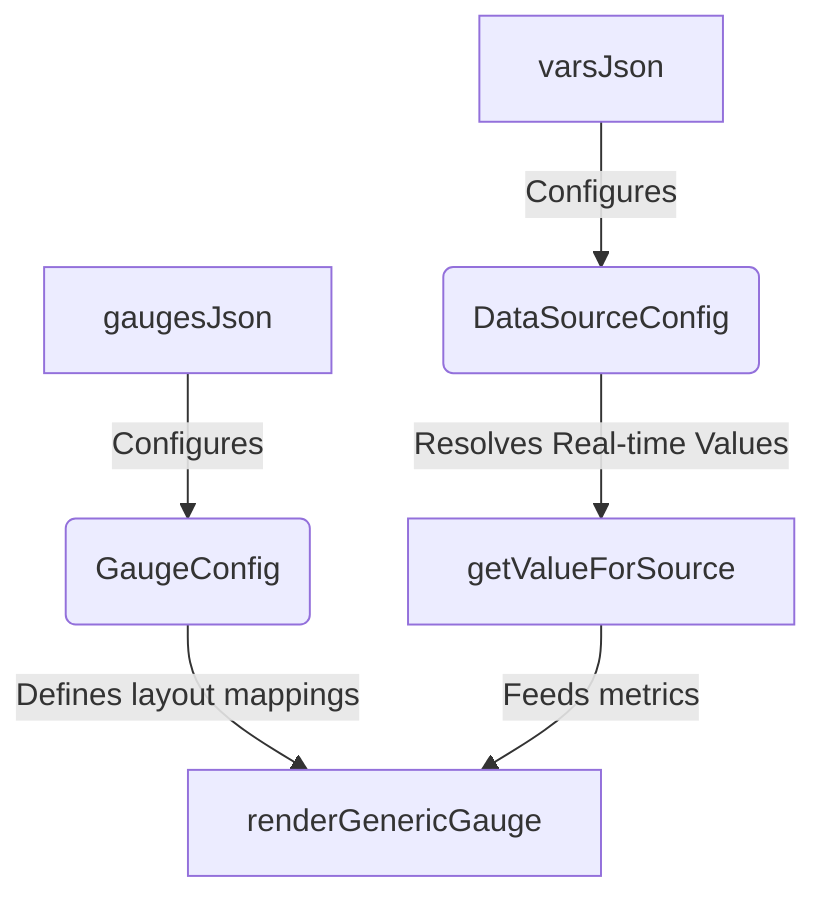

# 32GAUGE JSON Configuration Guide

This guide explains how to configure variables (Data Sources) and dashboard layouts (Gauge Profiles) in the 32GAUGE firmware using dynamic, data-driven JSON strings. 

By separating variables from rendering layouts, you can easily add new sensors, pull custom OBD parameters, customize your gauges, and change display metrics without modifying rendering logic or re-writing C++ mathematics.

---

## Architecture Overview

The system is split into two JSON arrays defined in [ConfigManager.cpp](file:///c:/Users/clayt/Documents/PlatformIO/Projects/32GUAGE/src/ConfigManager.cpp):
1. **`varsJson` (Data Sources)**: Maps where data comes from (OBD-II CAN queries or physical Analog pins) and how it should be converted into raw numbers.
2. **`gaugesJson` (Gauge Profiles)**: Defines how those variables are represented visually on the round LCD dashboard.



---

## 1. Defining Data Sources (`varsJson`)

The `varsJson` array defines your registers. Each variable in this list holds metadata describing its communication type, address, and math.

### JSON Fields for Data Sources

| Field | Type | Description |
| :--- | :--- | :--- |
| `id` | String | **Unique identifier** used to reference this metric in gauge profiles (e.g. `"waterTemp"`). |
| `type` | String | Either `"obd"` (TWAI CAN query) or `"analog"` (physical board pins). |
| `pid` | Integer | *(OBD only)* The hex PID code to query (represented as a base-10 integer). |
| `formula` | Integer | *(OBD only)* The decoding formula index applied to raw return bytes (0 to 7). |
| `pin` | Integer | *(Analog only)* The physical ESP32 GPIO pin number (e.g., `18`). |
| `multiplier` | Float | *(Analog only)* Slope coefficient ($M$) in the linear equation $Y = MX + B$. |
| `offset` | Float | *(Analog only)* Intercept constant ($B$) in the linear equation $Y = MX + B$. |

---

### A. Configuring OBD Sources
OBD queries poll the vehicle's Engine Control Unit (ECU) over CAN. They are processed through a dynamic schedule; only PIDs required by the *currently active screen* are polled to ensure maximum refresh rates.

#### Common OBD Formula Indexes:
* **`0` (`RAW_A`)**: Returns the first byte. Useful for simple 8-bit values (e.g., Speed in km/h).
* **`2` (`A_MINUS_40`)**: Subtracts 40 from the first byte. Used for all ECU temperatures.
* **`3` (`AB_DIV_4`)**: Combines high and low bytes and divides by 4. Used for **Engine RPM**.
* **`4` (`AB_DIV_100`)**: Combines bytes and divides by 100. Used for **MAF Airflow**.
* **`5` (`A_DIV_2_55`)**: Divides by 2.55 to get standard 0-100% ranges. Used for **Throttle Position**.
* **`7` (`LINEAR_AB`)**: Combines bytes to represent a raw 16-bit word. Used for **Lambda** ratio.

#### Example:
```json
{ "id": "waterTemp", "type": "obd", "pid": 5, "formula": 2 }
```

---

### B. Configuring Analog Sources
Analog sensors read voltage directly from physical ESP32 GPIO pins. 

Before applying your JSON `multiplier` and `offset`, the firmware automatically converts raw 12-bit ADC values (0-4095) into **compensated sensor volts** ($0\text{V} - 6.6\text{V}$), automatically accounting for the board's internal $3.3\text{V}$ reference and $50/50$ hardware voltage divider.

#### Calculating your Multiplier and Offset:
You can pull these values directly from your sensor's data sheets.
$$\text{Output Value} = (\text{Sensor Volts} \times \text{Multiplier}) + \text{Offset}$$

* **Example (150 PSI Sensor)**:
  * At $0.5\text{V}$, pressure is $0\text{ PSI}$.
  * At $4.5\text{V}$, pressure is $150\text{ PSI}$.
  * $Slope\ (\text{Multiplier}) = \frac{150 - 0}{4.5 - 0.5} = \mathbf{37.5}$
  * $Intercept\ (\text{Offset}) = 0 - (37.5 \times 0.5) = \mathbf{-18.75}$

#### Example:
```json
{ "id": "fuelPress", "type": "analog", "pin": 18, "multiplier": 37.5, "offset": -18.75 }
```

---

## 2. Defining Gauge Profiles (`gaugesJson`)

The `gaugesJson` array defines your dashboards. Swiping the touchscreen cycles through these profiles sequentially.

### JSON Fields for Gauge Profiles

| Field | Type | Description |
| :--- | :--- | :--- |
| `type` | String | `"standard"`, `"shiftlight"`, or `"gmeter"`. |
| `name` | String | Label displayed on screen and logged during profile changes. |
| `mainSourceId` | String | The `id` of the variable mapped to the primary circular arc and large digital text. |
| `minVal` | Float | The value corresponding to the $0\%$ (start) point of the dial arc. |
| `maxVal` | Float | The value corresponding to the $100\%$ (end) point of the dial arc. |
| `unitLabel` | String | Text drawn below the main digital reading (e.g. `"RPM"`, `"HP"`). |
| `boostUnits` | Boolean | *(Optional)* If `true`, enables dynamic scaling (negative is `inHg` vacuum, positive is `PSI` boost). |
| `secondaries` | Array | A list of up to 3 sub-metrics to draw in the lower portion of the screen. |

### Secondary Metric Objects

| Field | Type | Description |
| :--- | :--- | :--- |
| `sourceId` | String | The `id` of the variable to poll. |
| `prefix` | String | Text drawn before the value (e.g. `"Water: "`). |
| `suffix` | String | Text drawn after the value (e.g. `"C"`). |
| `posY` | Integer | Vertical pixel coordinate on the LCD to position the text (typically `140` to `210`). |
| `dynamicColor` | Boolean | If `true`, applies cold-to-hot (blue $\to$ red) color shifts (perfect for temperature readouts). |

---

## 3. Real-World Examples

### Example A: Standard Dynamic Boost Gauge
This gauge uses the `boostUnits` flag. It reads GPIO Pin 18 (calibrated to $inHg$ absolute vacuum). When negative, it draws `Boost (inHg)`. When positive, it automatically divides the reading by `2.03602f` and draws `Boost (PSI)`.

```json
// In varsJson:
{ "id": "boostPress", "type": "analog", "pin": 18, "multiplier": 30.7692, "offset": -28.2692 }

// In gaugesJson:
{
  "type": "standard",
  "name": "Gauge 1: Boost",
  "mainSourceId": "boostPress", 
  "minVal": -10.0, "maxVal": 25.0,
  "unitLabel": "Boost (PSI)",
  "boostUnits": true,
  "secondaries": [
    { "sourceId": "waterTemp", "prefix": "Water: ", "suffix": "C", "posY": 180, "dynamicColor": true },
    { "sourceId": "intakeTemp", "prefix": "AIT: ", "suffix": "C", "posY": 208, "dynamicColor": false }
  ]
}
```

### Example B: Custom 150 PSI Fuel Pressure Dashboard
Adding a dedicated Fuel Pressure sensor to the spare GPIO 17 analog pin, drawing a full sweeping standard gauge, and printing Ethanol percentages and battery voltage at the bottom.

```json
// In varsJson:
{ "id": "fuelPress", "type": "analog", "pin": 17, "multiplier": 37.5, "offset": -18.75 }

// In gaugesJson:
{
  "type": "standard",
  "name": "Gauge 5: Fuel Pressure",
  "mainSourceId": "fuelPress", 
  "minVal": 0.0, "maxVal": 100.0,
  "unitLabel": "PSI",
  "secondaries": [
    { "sourceId": "ethanol", "prefix": "Ethanol: ", "suffix": "%", "posY": 150, "dynamicColor": false },
    { "sourceId": "battery", "prefix": "Volts: ", "suffix": "V", "posY": 180, "dynamicColor": false }
  ]
}
```

---

## 4. Key Limitations & Constraints

To keep memory allocation extremely fast and prevent stack overflows on the ESP32 chip:
1. **Data Source Limit**: Maximum **8** active data sources can be defined in `varsJson`.
2. **Gauge Limit**: Maximum **6** gauge profiles can be defined in `gaugesJson`.
3. **Secondary readouts**: A maximum of **3** secondary readouts can be bound per gauge screen.
4. **Active PID Schedule**: Changing pages dynamically frees non-active OBD metrics. PIDs that are not on the active screen's layout or dependency lists are immediately pruned from the TWAI scheduling queue.
